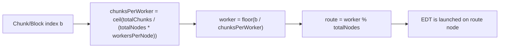
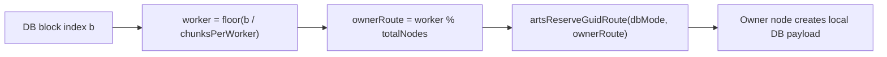
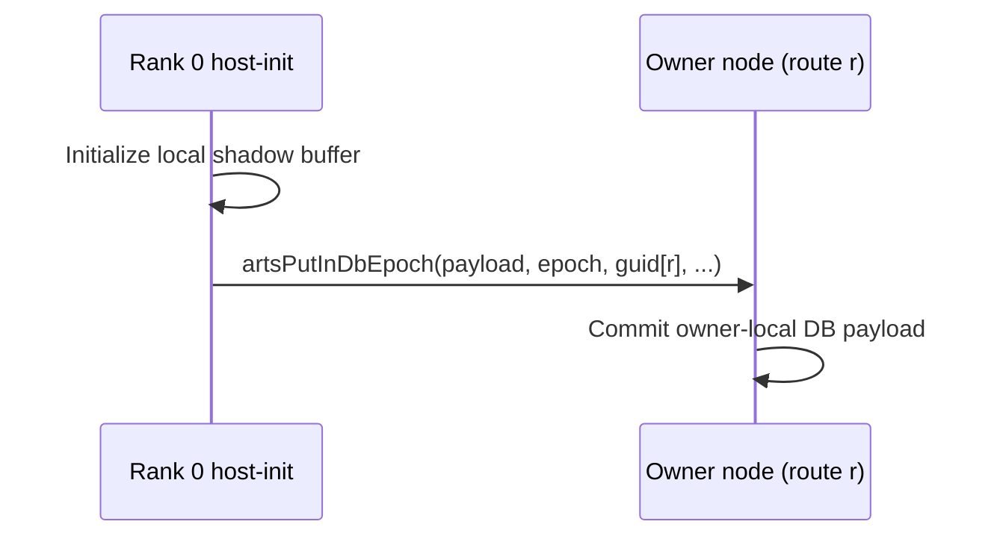

# llama2-transformer CARTS Analysis

## Summary

The llama2-transformer benchmark is a simple transformer model that is used to generate text.


## Next Steps to Debug

### 1. Verify IR Generation

**Build carts if any changes were made:**

```bash
  carts build
```

If there is no transformer.mlir run:

```bash
  carts cgeist transformer.c -DMINI_DATASET -O0 --print-debug-info -S --raise-scf-to-affine &> transformer_seq.mlir
  carts run transformer_seq.mlir --collect-metadata &> transformer_arts_metadata.mlir
  carts cgeist transformer.c -DMINI_DATASET -O0 --print-debug-info -S -fopenmp --raise-scf-to-affine &> transformer.mlir
```

### 2. Run the pipeline and stop after any stage
Run the pipeline and stop after any stage.

For example, lets analyze the canonicalize-memrefs pass
```bash
  carts run transformer.mlir --canonicalize-memrefs &> transformer_canonicalize.mlir
```

Check that is failing... fix it. the canonicalize-memrefs should be able to canonicalize memrefs of N dimensions. Enable debug logging and check the logs.
```bash
  carts run transformer.mlir --canonicalize-memrefs --debug-only=canonicalize-memrefs &> transformer_canonicalize.mlir
```
In the final output look for memrefs like:
```
  %alloc_22 = memref.alloc(%24, %27, %15) : memref<?x?x?xf32>
```
and deallocations like:
```
  memref.dealloc %alloc_22 : memref<?x?x?xf32>
```
and check that the original memrefs and deallocations are not present in the output.

### 3. Check the concurrency pass
```bash
  carts run transformer.mlir --concurrency &> transformer_concurrency.mlir
```
Check how the for loops are lowered. Check that the for loops are lowered to arts.for operations.

### 4. Check the concurrency-opt pass
```bash
  carts run transformer.mlir --concurrency-opt &> transformer_concurrency_opt.mlir
```
Check the output of the dbpass, specially the partition in the dbpass with "--debug-only=db"
Make sure to check the second run of the dbpass, the one that is after the concurrency-opt pass.

### 5. Run with carts execute
```bash
  carts execute transformer.c -O3 &> transformer_execute.txt
```
Check that the output is correct.

### 6. Run with carts benchmarks (ommit this step for now)

```bash
carts benchmarks run llama2-transformer --trace       

CARTS Benchmark Runner v0.1.0
━━━━━━━━━━━━━━━━━━━━━━━━━━━━━━
Config: size=small, timeout=60s, parallel=1, verify=True, clean=True
Benchmarks: 1


═══ CARTS Output (llama2-transformer) ═══
(no benchmark output)

═══ OMP Output (llama2-transformer) ═══
(no benchmark output)

╭────────────────────┬────────────┬───────────┬──────────┬─────────┬─────────┬─────────╮
│ Benchmark          │ Build ARTS │ Build OMP │ Run ARTS │ Run OMP │ Correct │ Speedup │
├────────────────────┼────────────┼───────────┼──────────┼─────────┼─────────┼─────────┤
│ llama2-transformer │   ✗ 0.8s   │  ✓ 2.0s   │  ○ skip  │ ✗ fail  │  - N/A  │       - │
╰────────────────────┴────────────┴───────────┴──────────┴─────────┴─────────┴─────────╯
✓ 0 passed  ✗ 0 failed  ○ 0 pending  ⏱ 3.1s

╭──────────────────────────────────────────── Summary ────────────────────────────────────────────╮
│ ✓ 0 passed  ✗ 0 failed  ○ 1 skipped  ⏱ 3.07s                                                    │
```

---

<!-- BEGIN DISTRIBUTION DIAGRAMS -->
## Distribution Diagrams

These diagrams show how CARTS/ARTS distribute work and datablocks for this
example when internode routing is enabled.

### 1) Work Routing (ForLowering)



### 2) Distributed DB Ownership



### 3) Host-Init Read-Only DB Flush Path



### 4) Verification Commands

```bash
# Task routing + distributed markers
carts run <example>.mlir --concurrency --debug-only=for_lowering 2>&1 | \
  rg "route|worker|distributed"

# Partitioning/full-range decisions
carts run <example>.mlir --concurrency-opt --debug-only=db,db_partitioning 2>&1 | \
  rg "partition|full-range|mode"

# LLVM/runtime ownership calls
rg -n "initPerNode|artsReserveGuidRoute|artsDbCreateRemote|artsPutInDbEpoch" \
  <example>-arts.ll
```

Notes:
- `READ` acquire means task must not modify payload.
- `WRITE` acquire means task may modify payload.
- Mutable host-store+host-load allocations are currently
  kept local (no distributed host-readback path is emitted).
<!-- END DISTRIBUTION DIAGRAMS -->
