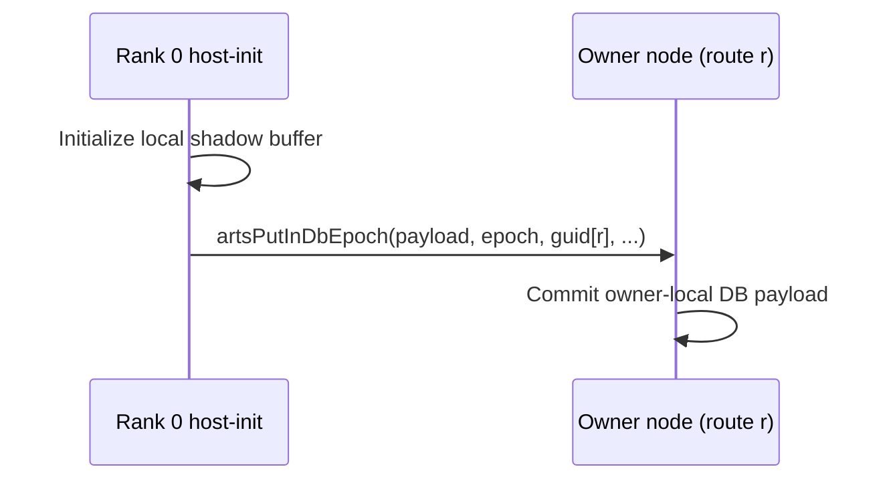

# lulesh example analysis

Walk through these steps and fix any problem that you find in the way
1. **Navigate to the lulesh example directory:**

   ```bash
   cd /Users/randreshg/Documents/carts/external/carts-benchmarks/lulesh
   ```

2. **Build carts if any changes were made:**

   ```bash
   carts build
   ```

   If there is no `lulesh.mlir` run:

   ```bash
   carts cgeist lulesh.c -DMINI_DATASET -O0 --print-debug-info -S --raise-scf-to-affine -I. -I../common -I../utilities &> lulesh_seq.mlir
   carts run lulesh_seq.mlir --collect-metadata &> lulesh_arts_metadata.mlir
   carts cgeist lulesh.c -DMINI_DATASET -O0 --print-debug-info -S -fopenmp --raise-scf-to-affine -I. -I../common -I../utilities &> lulesh.mlir
   ```

3. **Run the pipeline and stop after any stage**
   Run the pipeline and stop after any stage.

   For example, check canonicalize-memrefs:
   ```bash
   carts run lulesh.mlir --canonicalize-memrefs &> lulesh_canonicalize_memrefs.mlir
   ```
   Check that array-of-arrays are rewritten to explicit memref dimensions:
   ```mlir
   // nodelist: Index_t** -> memref<?x?xi32> (outer = element, inner = 8)
   %nodelist = memref.alloc(%numElem, %c8) : memref<?x?xi32>
   ```

   For example, analyze the create-dbs pipeline:
   ```bash
   carts run lulesh.mlir --create-dbs &> lulesh_create_dbs.mlir
   ```
   Check that `arts.db_alloc` uses outer dims as `sizes[...]` and inner dims
   in `elementSizes[...]`, and that `arts.db_ref` indexes the outer dimension
   before accessing the inner memref.

   If you need to inspect initialization values, enable the debug prints:
   ```bash
   CARTS_LULESH_DEBUG=1 ./lulesh_arts -s 3 -i 1
   ```
   This prints `e/p/q/v/volo/nodalMass` and `nodelist` values after init.

4. **Concurrency-opt checkpoint**
   ```bash
   carts run lulesh.mlir --concurrency-opt &> lulesh_concurrency_opt.mlir
   ```
   Check that arrays tied to the parallel loop are chunked only when the
   access is direct. For indirect gathers (e.g., `x/y/z` indexed by
   `nodelist`), the default is coarse. If an allocation has both direct and
   indirect accesses, it may still be blocked, with indirect read-only acquires
   marked full-range. To experiment with element-wise fallback:
   ```bash
   carts run lulesh.mlir --concurrency-opt --partition-fallback=fine \
     &> lulesh_concurrency_opt_fine.mlir
   ```

5. **Finally lets carts execute and check**

   ```bash
   carts execute lulesh.c -O3 -DMINI_DATASET -I. -I../common -I../utilities
   artsConfig=arts.cfg ./lulesh_arts -s 3 -i 5
   ```

6. **Run with carts benchmarks and check**

   ```bash
   carts benchmarks run lulesh --size small
   ```
   To pass partition-fallback through the benchmark runner:
   ```bash
   carts benchmarks run lulesh --size small \
     --arts-exec-args "--run-args '--partition-fallback=fine'"
   ```

## Performance Investigation (Why ARTS is Much Slower)

On MINI_DATASET, OpenMP is extremely fast while ARTS can be seconds slower.
This is expected with the current partitioning and task granularity.

### What the current partitioning looks like

Generate the current concurrency-opt IR and inspect allocations/acquires:

```bash
cd /Users/randreshg/Documents/carts/external/carts-benchmarks/lulesh
carts run lulesh.mlir --concurrency-opt > /Users/randreshg/Documents/carts/lulesh_concurrency_opt_current.mlir
```

Count coarse vs block allocations:

```bash
python - <<'PY'
import re
from collections import Counter
path='/Users/randreshg/Documents/carts/lulesh_concurrency_opt_current.mlir'
pat=re.compile(r'arts\\.db_alloc\\[(.*?)\\]')
counts=Counter()
for line in open(path):
    if 'arts.db_alloc' not in line: continue
    m=pat.search(line)
    if not m: continue
    tags=re.findall(r'<([^>]+)>', m.group(1))
    if tags: counts[tags[-1].strip()]+=1
print(counts)
PY
```

List coarse allocations and map to source lines:

```bash
python - <<'PY'
import re
path='/Users/randreshg/Documents/carts/lulesh_concurrency_opt_current.mlir'
pat=re.compile(r'arts\\.db_alloc\\[(.*?)\\].*?allocationId = \"([^\"]+)\"')
coarse=set()
for line in open(path):
    if 'arts.db_alloc' not in line: continue
    m=pat.search(line)
    if not m: continue
    tags=re.findall(r'<([^>]+)>', m.group(1))
    if tags and tags[-1].strip()=='coarse':
        coarse.add(m.group(2))
print(sorted(coarse))
PY
```

Typical coarse allocations include `xdd/ydd/zdd`, `e/ql/qq/ss`,
and `nodeElemCornerList` (see lines ~2605–2632 and ~2729 in `lulesh.c`).
These are heavily used in the timestep loop, so coarse mode serializes
the tasks that touch them.

### Full-range acquires on blocked allocations

Many node arrays (`x/y/z`, `xd/yd/zd`, `fx/fy/fz`, `nodalMass`) are blocked,
but they are also accessed indirectly via `nodelist`. The partitioner keeps
the allocation blocked for direct uses, yet **indirect read-only acquires are
full-range** (offsets `%c0`, sizes = number of blocks). You can see these
patterns with:

```bash
rg -n "db_acquire.*partitioning\\(<block>.*offsets\\[%c0\\]" \
  /Users/randreshg/Documents/carts/lulesh_concurrency_opt_current.mlir | head
```

Full-range acquires are correct, but they still force wide synchronization
and block writers to the same array during those phases. This reduces
parallelism substantially.

### Why OpenMP wins on MINI_DATASET

- The problem size is tiny; ARTS task creation + db_acquire/db_release overhead
  dominates runtime.
- Coarse allocations (and full-range acquires on blocked allocations) serialize
  critical phases, so ARTS does not realize parallel speedups.
- OpenMP has low overhead and the loops are short, so it finishes in milliseconds.

### What would improve ARTS performance

- **Split read/write layouts**: blocked for direct writes, fine-grained for
  indirect reads (versioned copy + sync).
- **Finer-grained partitioning for node arrays** when indirect access dominates
  (enable `--partition-fallback=fine` and validate behavior).
- **Reduce full-range acquires** by separating indirect readers into their own
  datablock or by adding versioned buffers.

---

<!-- BEGIN DISTRIBUTION DIAGRAMS -->
## Distribution Diagrams

These diagrams show how CARTS/ARTS distribute work and datablocks for this
example when internode routing is enabled.

### 1) Work Routing (ForLowering)


### 2) Distributed DB Ownership


### 3) Host-Init Read-Only DB Flush Path



### 4) Verification Commands

```bash
# Task routing + distributed markers
carts run <example>.mlir --concurrency --debug-only=for_lowering 2>&1 | \
  rg "route|worker|distributed"

# Partitioning/full-range decisions
carts run <example>.mlir --concurrency-opt --debug-only=db,db_partitioning 2>&1 | \
  rg "partition|full-range|mode"

# LLVM/runtime ownership calls
rg -n "initPerNode|artsReserveGuidRoute|artsDbCreateRemote|artsPutInDbEpoch" \
  <example>-arts.ll
```

Notes:
- `READ` acquire means task must not modify payload.
- `WRITE` acquire means task may modify payload.
- Mutable host-store+host-load allocations are currently
  kept local (no distributed host-readback path is emitted).
<!-- END DISTRIBUTION DIAGRAMS -->
