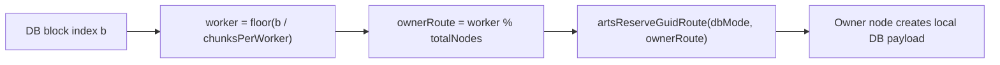
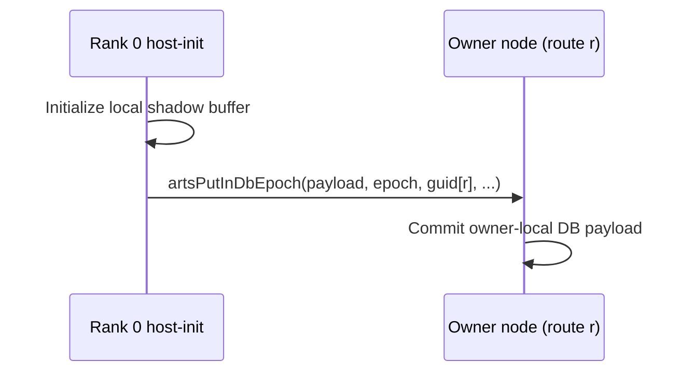

# batchnorm example analysis

Walk through these steps and fix any problem that you find in the way

---

## Bug Fix: Verification Failure (Fixed)

**Problem:** Same as layernorm - checksum verification was failing due to normalized data producing near-zero sums.

**Root Cause:** Batch normalization produces values centered around 0 per-channel. The original checksum computed `sum(output)` which is ~0 for normalized data, making it highly sensitive to floating-point rounding differences.

**Fix:** Changed checksum to use `sum(|x|)` instead of `sum(x)`. See layernorm/docs/analysis.md for full details.

**Result:** Verification passes with 9.74x speedup.

---

1. **Navigate to the batchnorm example directory:**

   ```bash
   cd /opt/carts/external/carts-benchmarks/ml-kernels/batchnorm
   ```

2. **Build carts if any changes were made:**

   ```bash
   carts build
   ```

   If there is no batchnorm.mlir run:

   ```bash
      carts cgeist batchnorm.c -DMINI_DATASET -O0 --print-debug-info -S --raise-scf-to-affine -I. -I../common -I../utilities &> batchnorm_seq.mlir
      carts run batchnorm_seq.mlir --collect-metadata &> batchnorm_arts_metadata.mlir
      carts cgeist batchnorm.c -DMINI_DATASET -O0 --print-debug-info -S -fopenmp --raise-scf-to-affine -I. -I../common -I../utilities > batchnorm.mlir
   ```

3. **Run the pipeline and stop after any stage**
    Run the pipeline and stop after any stage.

   For example, lets analyze the create-dbs pipeline
    ```bash
      carts run batchnorm.mlir --create-dbs --debug-only=canonicalize-memrefs &> batchnorm_create-dbs.mlir
    ```
   Lets investigate why the canonicalize-memrefs pass is failing. Check if the code has something we do not provide support for. Remember that the canonicalize-memrefs should be able to canonicalize memrefs of N dimensions.

4. **Finally lets carts execute and check**
```bash
    carts execute batchnorm.c -O3 -DMINI_DATASET -I. -I../common -I../utilities
   ./batchnorm_arts
```

---

<!-- BEGIN DISTRIBUTION DIAGRAMS -->
## Distribution Diagrams

These diagrams show how CARTS/ARTS distribute work and datablocks for this
example when internode routing is enabled.

### 1) Work Routing (ForLowering)


### 2) Distributed DB Ownership



### 3) Host-Init Read-Only DB Flush Path



### 4) Verification Commands

```bash
# Task routing + distributed markers
carts run <example>.mlir --concurrency --debug-only=for_lowering 2>&1 | \
  rg "route|worker|distributed"

# Partitioning/full-range decisions
carts run <example>.mlir --concurrency-opt --debug-only=db,db_partitioning 2>&1 | \
  rg "partition|full-range|mode"

# LLVM/runtime ownership calls
rg -n "initPerNode|artsReserveGuidRoute|artsDbCreateRemote|artsPutInDbEpoch" \
  <example>-arts.ll
```

Notes:
- `READ` acquire means task must not modify payload.
- `WRITE` acquire means task may modify payload.
- Mutable host-store+host-load allocations are currently
  kept local (no distributed host-readback path is emitted).
<!-- END DISTRIBUTION DIAGRAMS -->
