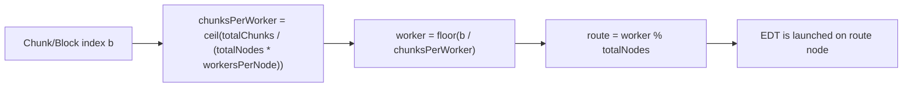
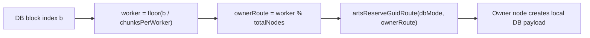
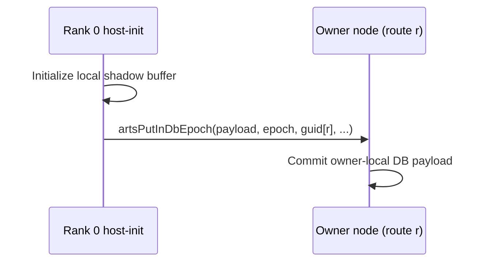

# Monte Carlo Ensemble Analysis

## Summary

This benchmark allocates a per-sample state matrix inside the parallel loop
to exercise distributed memory allocation. OpenMP reductions on `double`
are currently not supported in the CARTS pipeline, so the implementation
stores each sample result into a `sample_sums` array and performs a serial
reduction after the parallel region.

## Build and Run

```bash
cd /Users/randreshg/Documents/carts
./tools/carts build

cd external/carts-benchmarks/monte-carlo/ensemble
make small
./monte_carlo_ensemble_arts
./build/monte_carlo_ensemble_omp
```

Or via the benchmark runner:

```bash
./tools/carts benchmarks run monte-carlo/ensemble --size small
```

## Expected Behavior

- ARTS and OpenMP should report matching `checksum` values.
- Each sample allocates and frees its own state matrix inside the loop.

## Notes

- `arts.cfg` is sourced from `external/carts-benchmarks/arts.cfg` when the
  local suite does not provide one.
- Per-sample results are accumulated after the parallel loop to avoid
  unsupported OpenMP reductions or atomics.

---

<!-- BEGIN DISTRIBUTION DIAGRAMS -->
## Distribution Diagrams

These diagrams show how CARTS/ARTS distribute work and datablocks for this
example when internode routing is enabled.

### 1) Work Routing (ForLowering)



### 2) Distributed DB Ownership



### 3) Host-Init Read-Only DB Flush Path



### 4) Verification Commands

```bash
# Task routing + distributed markers
carts run <example>.mlir --concurrency --debug-only=for_lowering 2>&1 | \
  rg "route|worker|distributed"

# Partitioning/full-range decisions
carts run <example>.mlir --concurrency-opt --debug-only=db,db_partitioning 2>&1 | \
  rg "partition|full-range|mode"

# LLVM/runtime ownership calls
rg -n "initPerNode|artsReserveGuidRoute|artsDbCreateRemote|artsPutInDbEpoch" \
  <example>-arts.ll
```

Notes:
- `READ` acquire means task must not modify payload.
- `WRITE` acquire means task may modify payload.
- Mutable host-store+host-load allocations are currently
  kept local (no distributed host-readback path is emitted).
<!-- END DISTRIBUTION DIAGRAMS -->
