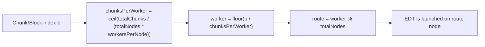
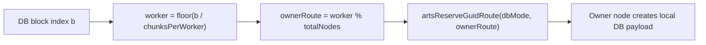
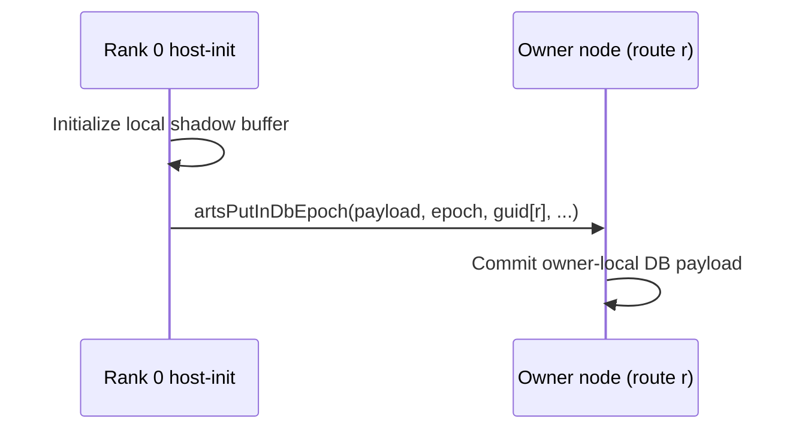

# fdtd-2d example analysis

Walk through these steps and fix any problem that you find in the way

1. **Navigate to the fdtd-2d example directory:**

   ```bash
   cd ~/Documents/carts/external/carts-benchmarks/polybench/fdtd-2d
   ```

2. **Build carts if any changes were made:**

   ```bash
   carts build
   ```

   If there is no array.mlir run:

   ```bash
      carts cgeist fdtd-2d.c -DMINI_DATASET -O0 --print-debug-info -S --raise-scf-to-affine -I. -I../common -I../utilities &> fdtd-2d_seq.mlir
      carts run fdtd-2d_seq.mlir --collect-metadata &> fdtd-2d_arts_metadata.mlir
      carts cgeist fdtd-2d.c -DMINI_DATASET -O0 --print-debug-info -S -fopenmp --raise-scf-to-affine -I. -I../common -I../utilities &> fdtd-2d.mlir
   ```

3. **Run the pipeline and stop after any stage**
    Run the pipeline and stop after any stage.

   For example, lets analyze the concurrency pipeline
    ```bash
      carts run fdtd-2d.mlir --concurrency &> fdtd-2d_concurrency.mlir
    ```
    Notice that it says that no arts.for operationn were found. This is an error...
    fix it. the arts.for might be in a nested region
   
4. **Concurrency-opt checkpoint:**
    ```bash
      carts run fdtd-2d.mlir --concurrency-opt &> fdtd-2d_concurrency_opt.mlir
    ```

4. **Finally lets carts execute and check**
```bash
    carts execute fdtd-2d.c -O3 -DMINI_DATASET -I. -I../common -I../utilities
   ./fdtd-2d_arts
```

---

<!-- BEGIN DISTRIBUTION DIAGRAMS -->
## Distribution Diagrams

These diagrams show how CARTS/ARTS distribute work and datablocks for this
example when internode routing is enabled.

### 1) Work Routing (ForLowering)



### 2) Distributed DB Ownership



### 3) Host-Init Read-Only DB Flush Path



### 4) Verification Commands

```bash
# Task routing + distributed markers
carts run <example>.mlir --concurrency --debug-only=for_lowering 2>&1 | \
  rg "route|worker|distributed"

# Partitioning/full-range decisions
carts run <example>.mlir --concurrency-opt --debug-only=db,db_partitioning 2>&1 | \
  rg "partition|full-range|mode"

# LLVM/runtime ownership calls
rg -n "initPerNode|artsReserveGuidRoute|artsDbCreateRemote|artsPutInDbEpoch" \
  <example>-arts.ll
```

Notes:
- `READ` acquire means task must not modify payload.
- `WRITE` acquire means task may modify payload.
- Mutable host-store+host-load allocations are currently
  kept local (no distributed host-readback path is emitted).
<!-- END DISTRIBUTION DIAGRAMS -->
