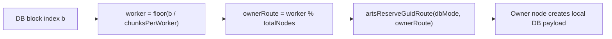
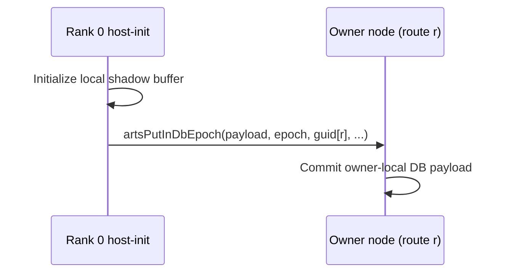

# Jacobi2D Example Analysis

Walk through these steps and fix any problem that you find in the way.

## 1. Navigate to the jacobi2d example directory

```bash
cd ~/Documents/carts/external/carts-benchmarks/polybench/jacobi2d
```

## 2. Build CARTS if any changes were made

```bash
carts build
```

If there is no jacobi2d.mlir, run:

```bash
carts cgeist jacobi2d.c -O0 --print-debug-info -S --raise-scf-to-affine -I. -I../common -I../utilities &> jacobi2d_seq.mlir
carts run jacobi2d_seq.mlir --collect-metadata &> jacobi2d_arts_metadata.mlir
carts cgeist jacobi2d.c -O0 --print-debug-info -S -fopenmp --raise-scf-to-affine -I. -I../common -I../utilities &> jacobi2d.mlir
```

## 3. Run the pipeline and analyze output

### CanonicalizeMemrefs checkpoint

```bash
carts run jacobi2d.mlir --canonicalize-memrefs --debug-only=canonicalize_memrefs 2>&1 | head -100
```

Expected output shows two separate allocations for A and B:
```mlir
%alloc = memref.alloc(%4, %c1024_2) : memref<?x?xf32>    // A array
%alloc_4 = memref.alloc(%4, %c1024_3) : memref<?x?xf32>  // B array
```

### Concurrency pipeline

```bash
carts run jacobi2d.mlir --concurrency &> logs/concurrency.log
```

Check the output shows two `arts.db_alloc` operations:
```mlir
// Array A - Coarse grained allocation (read)
%guid, %ptr = arts.db_alloc[<in>, <heap>, <read>] route(%c0_i32 : i32) sizes[%c1] elementType(f32) elementSizes[%4, %c1024] {...}

// Array B - Coarse grained allocation (write)
%guid_9, %ptr_10 = arts.db_alloc[<out>, <heap>, <write>] route(%c0_i32 : i32) sizes[%c1] elementType(f32) elementSizes[%4, %c1024] {...}
```

### Concurrency-opt pipeline

```bash
carts run jacobi2d.mlir --concurrency-opt &> logs/concurrency-opt.log
```

## 4. Execute and verify

```bash
carts execute jacobi2d.c -O3 -I. -I../common -I../utilities
./jacobi2d_arts
./jacobi2d_omp
```

Both should produce matching checksums.

---

## Historical Issue: Pointer-Swap Pattern Bug

The original jacobi2d.c used a pointer-swap pattern that caused incorrect transformations:

### Original problematic code

```c
for (int t = 0; t < TSTEPS; t++) {
    jacobi2d_step((const float **)A, B);  // Read A, Write B
    float **tmp = A;
    A = B;
    B = tmp;  // SWAP pointers!
}
```

### Why it failed

The pointer swap creates **wrapper allocas** in MLIR that hold pointer values:

```mlir
%alloca_0 = memref.alloca() : memref<memref<?xmemref<?xf32>>>  // A's wrapper
%alloca = memref.alloca() : memref<memref<?xmemref<?xf32>>>    // B's wrapper

// Initial stores:
memref.store %alloc, %alloca_0[]    // A→wrapper0
memref.store %alloc_1, %alloca[]    // B→wrapper1

// In timestep loop - SWAP stores:
memref.store %21, %alloca_0[]       // B's value→A's wrapper!
memref.store %20, %alloca[]         // A's value→B's wrapper!
```

The swap stores create a **circular alias relationship** between wrappers. CanonicalizeMemrefs detects each wrapper as an "outer wrapper alias" of the other, causing all kernel accesses to be attributed to ONE pattern instead of being split between A and B.

### Result of the bug

| Metric | Expected | Actual (buggy) |
|--------|----------|----------------|
| Allocations | 2 (A and B) | 1 (merged) |
| Init | A: non-zero, B: 0.0 | Only 0.0 |
| Kernel | Read A, Write B | Read/Write same |
| Checksum | ~132481.6 | 0.0 |

### Fix applied

Rewrote jacobi2d.c to use **explicit double-buffering** without pointer swap:

```c
for (int t = 0; t < TSTEPS; t += 2) {
    // Step 1: Read A, Write B (explicit)
    #pragma omp parallel for schedule(static)
    for (int i = 1; i < N - 1; i++)
        for (int j = 1; j < N - 1; j++)
            B[i][j] = 0.2f * (A[i][j] + A[i-1][j] + A[i+1][j] + A[i][j-1] + A[i][j+1]);

    // Step 2: Read B, Write A (explicit)
    if (t + 1 < TSTEPS) {
        #pragma omp parallel for schedule(static)
        for (int i = 1; i < N - 1; i++)
            for (int j = 1; j < N - 1; j++)
                A[i][j] = 0.2f * (B[i][j] + B[i-1][j] + B[i+1][j] + B[i][j-1] + B[i][j+1]);
    }
}
```

This avoids wrapper allocas entirely - each array access is directly to A or B with no indirection, so CanonicalizeMemrefs correctly handles them as separate allocations.

---

## Key Difference from convolution-2d

| Aspect | convolution-2d | jacobi2d (original) | jacobi2d (fixed) |
|--------|----------------|---------------------|------------------|
| Arrays | A (in), B (out) | A, B with swap | A, B explicit |
| Swap | None | Pointer swap each timestep | None |
| Wrappers | Independent | Circular alias | None needed |
| CARTS result | Correct | Wrong (merged) | Correct |

---

<!-- BEGIN DISTRIBUTION DIAGRAMS -->
## Distribution Diagrams

These diagrams show how CARTS/ARTS distribute work and datablocks for this
example when internode routing is enabled.

### 1) Work Routing (ForLowering)


### 2) Distributed DB Ownership



### 3) Host-Init Read-Only DB Flush Path



### 4) Verification Commands

```bash
# Task routing + distributed markers
carts run <example>.mlir --concurrency --debug-only=for_lowering 2>&1 | \
  rg "route|worker|distributed"

# Partitioning/full-range decisions
carts run <example>.mlir --concurrency-opt --debug-only=db,db_partitioning 2>&1 | \
  rg "partition|full-range|mode"

# LLVM/runtime ownership calls
rg -n "initPerNode|artsReserveGuidRoute|artsDbCreateRemote|artsPutInDbEpoch" \
  <example>-arts.ll
```

Notes:
- `READ` acquire means task must not modify payload.
- `WRITE` acquire means task may modify payload.
- Mutable host-store+host-load allocations are currently
  kept local (no distributed host-readback path is emitted).
<!-- END DISTRIBUTION DIAGRAMS -->
