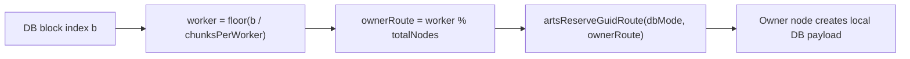
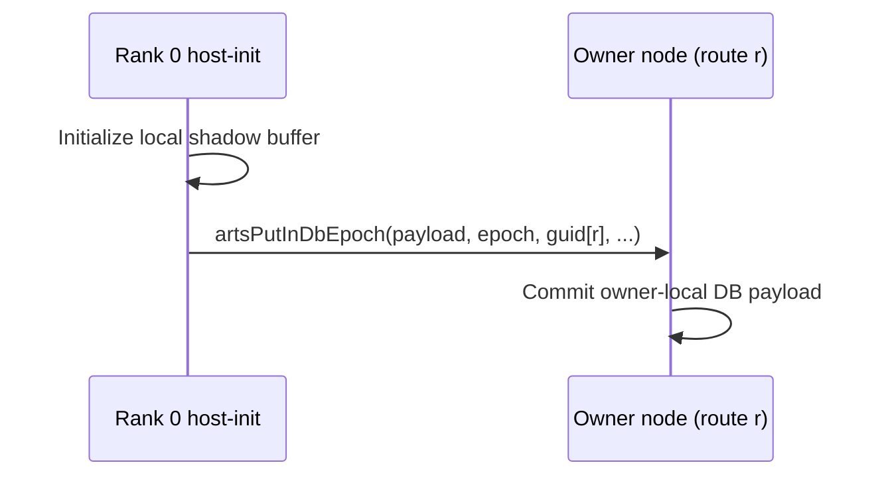

# velocity_update example analysis

Walk through these steps to debug CARTS pipeline issues.

## 1. Navigate to the velocity example directory

```bash
cd ~/Documents/carts/external/carts-benchmarks/specfem3d/velocity
```

## 2. Build CARTS if any changes were made

```bash
carts build
```

## 3. Generate MLIR from C source

Generate the sequential MLIR (for metadata):
```bash
carts cgeist velocity_update.c -O0 --print-debug-info -S --raise-scf-to-affine -I../common 2>/dev/null > /tmp/velocity_seq.mlir
```

Generate the parallel MLIR (with OpenMP):
```bash
carts cgeist velocity_update.c -O0 --print-debug-info -S -fopenmp --raise-scf-to-affine -I../common 2>/dev/null > /tmp/velocity_par.mlir
```

## 4. Run pipeline stages incrementally

### Stage 1: collect-metadata (on sequential code)
```bash
carts run /tmp/velocity_seq.mlir --collect-metadata 2>&1 | head -20
```

### Stage 2: openmp-to-arts
```bash
carts run /tmp/velocity_par.mlir --openmp-to-arts > /tmp/velocity_arts.mlir 2>&1
```

### Stage 3: create-dbs
```bash
carts run /tmp/velocity_par.mlir --create-dbs > /tmp/velocity_dbs.mlir 2>&1
```

### Stage 4: concurrency
```bash
carts run /tmp/velocity_par.mlir --concurrency > /tmp/velocity_conc.mlir 2>&1
```

## 5. Build and run the example

```bash
make clean && make all
./velocity_update_arts
```

---

## Issues Fixed

### Issue 1: Switch statement not supported

**Original code:**
```c
static inline float diff(const float ***arr, int i, int j, int k, int dir) {
  switch (dir) {
  case 0:
    return arr[i + 1][j][k] - arr[i][j][k];
  case 1:
    return arr[i][j + 1][k] - arr[i][j][k];
  default:
    return arr[i][j][k + 1] - arr[i][j][k];
  }
}
```

**Fix:** Replace with separate inline functions:
```c
static inline float diff_x(const float ***arr, int i, int j, int k) {
  return arr[i + 1][j][k] - arr[i][j][k];
}

static inline float diff_y(const float ***arr, int i, int j, int k) {
  return arr[i][j + 1][k] - arr[i][j][k];
}

static inline float diff_z(const float ***arr, int i, int j, int k) {
  return arr[i][j][k + 1] - arr[i][j][k];
}
```

### Issue 2: Collapse clause not supported

**Original:**
```c
#pragma omp parallel for collapse(2) schedule(static)
```

**Fix:**
```c
#pragma omp parallel for schedule(static)
```

### Issue 3: Early return not supported

**Original:**
```c
if (!vx || !vy || !vz || !rho || !sxx || !syy || !szz || !sxy || !sxz || !syz) {
  fprintf(stderr, "allocation failure\n");
  return 1;
}
```

**Fix:** Remove the early return check.

### Issue 4: Missing arts.cfg

**Fix:** Copy from another example:
```bash
cp ../stress/arts.cfg .
```

### Issue 5: Makefile naming mismatch

**Original:**
```makefile
EXAMPLE_NAME := velocity
```

**Fix:**
```makefile
EXAMPLE_NAME := velocity_update
```

---

## Verification

```bash
cd ~/Documents/carts/external/carts-benchmarks/specfem3d/velocity
make clean && make all
./velocity_update_arts

# Expected output:
# specfem3d_velocity checksum=-0.000000
```

---

<!-- BEGIN DISTRIBUTION DIAGRAMS -->
## Distribution Diagrams

These diagrams show how CARTS/ARTS distribute work and datablocks for this
example when internode routing is enabled.

### 1) Work Routing (ForLowering)


### 2) Distributed DB Ownership



### 3) Host-Init Read-Only DB Flush Path



### 4) Verification Commands

```bash
# Task routing + distributed markers
carts run <example>.mlir --concurrency --debug-only=for_lowering 2>&1 | \
  rg "route|worker|distributed"

# Partitioning/full-range decisions
carts run <example>.mlir --concurrency-opt --debug-only=db,db_partitioning 2>&1 | \
  rg "partition|full-range|mode"

# LLVM/runtime ownership calls
rg -n "initPerNode|artsReserveGuidRoute|artsDbCreateRemote|artsPutInDbEpoch" \
  <example>-arts.ll
```

Notes:
- `READ` acquire means task must not modify payload.
- `WRITE` acquire means task may modify payload.
- Mutable host-store+host-load allocations are currently
  kept local (no distributed host-readback path is emitted).
<!-- END DISTRIBUTION DIAGRAMS -->
